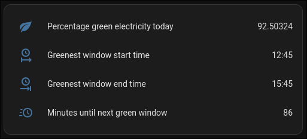
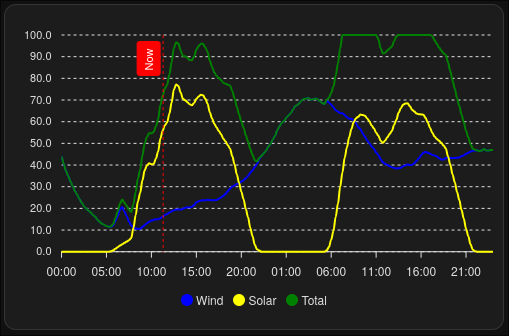

# vandebron-green-energy
Use this custom Home Assistant integration to get details about the green energy from Dutch energy provider Vandebron

## Installation
### Installation via HACS

[](https://my.home-assistant.io/redirect/hacs_repository/?owner=sambouwer&repository=vandebron-green-energy&category=integration)

### Manual installation
* Create a new folder `vandebron_green_energy`
* Download the files from this repository and save them inside the "vandebron_green_energy" folder so that you have `/homeassistant/custom_components/vandebron_green_energy`
* Restart Home Assistant
* Go to `Settings` > `Devices & services` and click the `+ Add integration` button
* Search for `vandebron`
* Add the `Vandebron Green Energy` integration
* Choose:
  * `Default Setup`: downloads data for today and tomorrow)
  * `Advanced Setup`: manually configure how many days need to be retrieved. `1` is only today, `2` is today and tomorrow, and so on
* Click Submit

## Configure dashboard
After configuring the integration you can make the retrieved data visible on your dashboard:

* Add a new card
* Choose "manual"
* Paste the following yaml code in the editor and save

```yaml
type: entities
entities:
  - entity: sensor.vandebron_greenpercentage_day_0
    icon: mdi:leaf
    name: Percentage green electricity today
  - entity: sensor.vandebron_green_window_start_time
    name: Greenest window start time
    icon: mdi:clock-start
  - entity: sensor.vandebron_green_window_end_time
    name: Greenest window end time
    icon: mdi:clock-end
  - entity: sensor.minutes_until_next_green_window
    name: Minutes until next green window
    icon: mdi:clock-fast
```



If you want to visualize the data in a graph:

* Install the `apexcharts-card` (see installation instructions here: https://github.com/RomRider/apexcharts-card)
* Add an ApexCharts Card to your dashboard and add the following code as an example to show data for today and tomorrow:

```yaml
type: custom:apexcharts-card
graph_span: 2 days
span:
  start: day
now:
  show: true
  color: red
  label: Now
all_series_config:
  stroke_width: 2
series:
  - entity: sensor.vandebron_forecast
    name: Wind
    color: blue
    show:
      legend_value: false
    data_generator: |
      return entity.attributes.timestamps.map((timestamp, index) => {
        return [new Date(timestamp).getTime(), entity.attributes.wind_percentages[index]];
      });
  - entity: sensor.vandebron_forecast
    name: Solar
    color: yellow
    show:
      legend_value: false
    data_generator: |
      return entity.attributes.timestamps.map((timestamp, index) => {
        return [new Date(timestamp).getTime(), entity.attributes.solar_percentages[index]];
      });
  - entity: sensor.vandebron_forecast
    name: Total
    color: green
    show:
      legend_value: false
    data_generator: |
      return entity.attributes.timestamps.map((timestamp, index) => {
        return [new Date(timestamp).getTime(), entity.attributes.green_percentages[index]];
      });

```



## Automations
You can create automations to start appliances in your home when the "greenest" 3 hour timeframe of the day starts with the entity `minutes_until_next_green_window`.

Example automation:

```yaml
alias: Turn on dishwasher during greenest energy window
description: ""
triggers:
  - trigger: numeric_state
    entity_id:
      - sensor.minutes_until_next_green_window
    below: 1
actions:
  - action: switch.turn_on
    metadata: {}
    data: {}
    target:
      entity_id: switch.dishwasher
```
